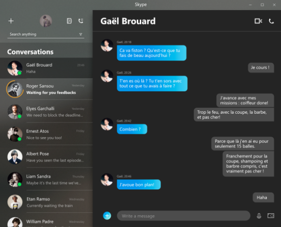
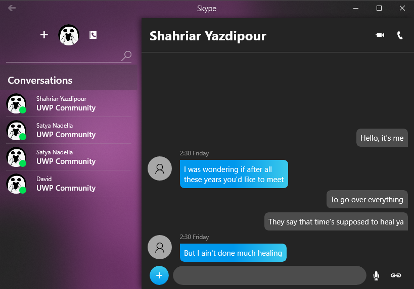

# Wind Os

I opened this repo to implement a couple of beautiful UI concepts in Xaml to show that UWP Applications can look much better with a little effort. 

I spent one or two hours (average) after I get home from work to write each Xaml Page. So I expect Microsoft Developers to spend more times and effort to improve Windows UWP Application.

I tried to do not share Xaml code between pages so that you can see all the xamls in a single file. My codes are not clean and I don't have much time making them better. If you think you can help, I accept pull request.

#### Build with AppCenter

# Sample

| Now    | Concept  | Wind Os
| :- |:- | :-
|  |  | 

|  | ToDo | Concepts    | Screenshot  | Code
| :- | :- | :- |:- | :-
| Terminal | ✔  | [Link🔗](./Inspiration/Terminal)  | [Link🔗](./Screenshots/Terminal.PNG)  | [Link🔗](./Windos/View/Terminal)
| Skype | ✔  | [Link🔗](./Inspiration/Skype)  | [Link🔗](./Screenshots/Skype.PNG)  | [Link🔗](./Windos/View/Skype)
| Calculator | ✔  | [Link🔗](./Inspiration/Calculator)  | [Link🔗](./Screenshots/Calculator.PNG)  | [Link🔗](./Windos/View/Calculator)
| Microsoft ToDo | ✔ | [Link🔗](./Inspiration/Todo)  | [Link🔗](./Screenshots/ToDo.PNG)  | [Link🔗](./Windos/View./Windos/View/ToDo)
| People | ✔  | [Link🔗](./Inspiration/People)  | [Link🔗](./Screenshots/People.PNG)  | [Link🔗](./Windos/View/People)
| Spotify | ❌  | [Link🔗](./Inspiration/Spotify)  | [Link🔗](./Screenshots/Spotify.PNG)  | [Link🔗](./Windos/View/Spotify)
| FileExplorer | ❌ | [Link🔗](./Inspiration/FileExplorer)  | [Link🔗](./Screenshots/FileExplorer.PNG)  | [Link🔗](./Windos/View/FileExplorer)

## Thanks to 😘:

####   Xaml Library 
* https://github.com/Microsoft/WindowsCommunityToolkit
* https://github.com/colinkiama/UWP-Circle-Button-Style-

#### UI Concepts

* [All the UI Concepts](./Inspiration)

* Calculator : https://dribbble.com/shots/4630198
* Spotify: https://dribbble.com/shots/3205842
* Skype: https://www.uplabs.com/posts/skype-app-concept-fluent-design
* People: https://www.uplabs.com/posts/people-app-concept-fluent-design
* Microsoft TODO: https://www.uplabs.com/posts/microsoft-to-do-app-concept-fluent-design

#### Icon Credits

* [All the Icons](./Inspiration/Icon)

* Main App Icon:  https://www.flaticon.com/free-icon/storm_932571
* Calcuator https://www.shareicon.net/finance-business-calculator-calculation-106878
* People https://www.truecaller.com/img/truecaller-app-icon-contacts.bf7fd78.png
* Skype https://cdn3.iconfinder.com/data/icons/complete-set-icons/512/skype512x512.png
* Terminal http://icons.iconarchive.com/icons/xenatt/the-circle/512/App-Terminal-icon.png

## Donate

* 

* 

* 
